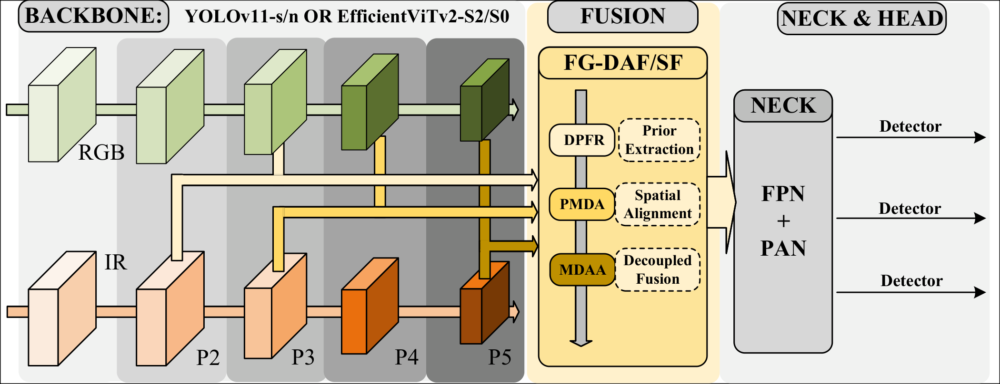
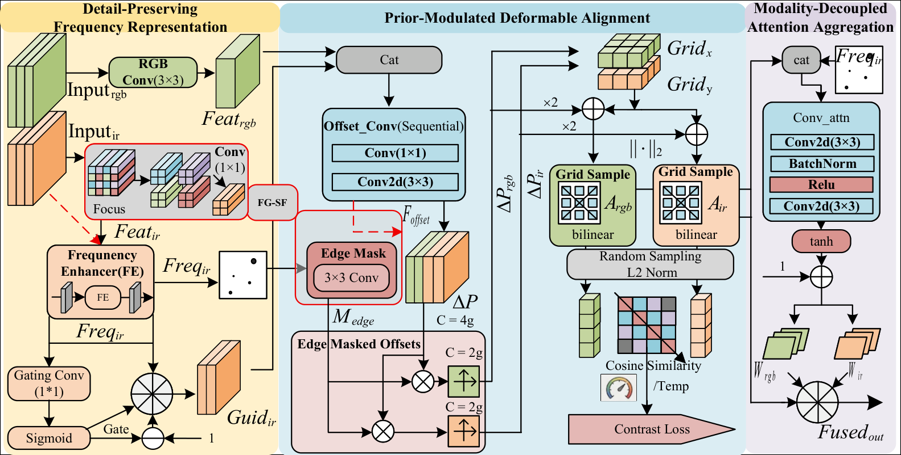

# FGD-Det: Frequency-Guided Decoupled Alignment and Asymmetric Fusion for Multispectral Object Detection

[](https://arxiv.org/)
[](https://github.com/zepher-kk/FGD-Det/blob/master/LICENSE)
[](https://www.python.org/)
[](https://github.com/ultralytics/ultralytics)

> **FGD-Det** tackles the twin bottlenecks of multispectral detection — **information density asymmetry** and **spatial misalignment** — through a frequency-guided decoupled alignment and asymmetric fusion framework. Achieves up to **97.9% AP₅₀** and **67.9% AP₅₀:₉₅** at only **47.0–64.6 GFLOPs**, outperforming methods costing 5–30× more compute.

<p align="center">
  
</p>

---

## Abstract

Multispectral object detection faces twin physical bottlenecks: **information density asymmetry** between dense RGB textures and sparse infrared signals, and **spatial misalignment** from sensor parallax. FGD-Det addresses these through:

1. **Heterogeneous Dual-Stream Backbone** — assigns an ultra-lightweight extraction path to the sparse IR modality, eliminating redundant computation at the source.
2. **Stage-wise Cross-Modal Fusion** — FG-DAF (Frequency-Guided Decoupled Alignment and Fusion) in shallow/middle layers uses IR high-frequency boundary priors to guide explicit pixel-level deformable registration; FG-SF (Frequency-Guided Symmetric Fusion) in the deepest layer relaxes hard spatial constraints for semantic consensus.
3. **Triple-Reference Evaluation (TRE)** — a diagnostic framework beyond standard mAP that classifies predictions into RGB-Grounded, Fused, X-Grounded, and Spurious behaviors.

## Key Highlights

| Aspect | FGD-Det |
|--------|---------|
| **Efficiency** | 47.0–64.6 GFLOPs (5–30% of comparable methods) |
| **LLVIP AP₅₀:₉₅** | **67.9%** — best among sub-100 GFLOPs methods |
| **FLIR AP₅₀:₉₅** | **48.8%** — outperforming most at comparable compute |
| **M3FD AP₅₀** | **88.7%** — leading lightweight approach |
| **Robustness** | 19.2% higher RFS_total vs baseline under parallax |
| **FPS** | 136 FPS (Ours-Y) on RTX 4090 |

## Architecture

### Modality-Aware Asymmetric Backbone

Unlike conventional mirrored dual-stream designs, FGD-Det allocates larger parameter capacity to the RGB path and an ultra-lightweight backbone to the IR path (e.g., YOLO11-s/n or EfficientViTv2-S2/S0 combos), matching resource allocation to actual modal information densities.

### FG-DAF: Frequency-Guided Decoupled Alignment and Fusion

Designed for shallow/middle layers where geometric deviations dominate. A three-stage cascaded pipeline:

<p align="center">
  
</p>

1. **DPFR (Detail-Preserving Frequency Representation)** — lossless Focus downsampling + Frequency Enhancer with learnable spectral modulation, extracting clean high-frequency structural priors from IR.
2. **PMDA (Prior-Modulated Deformable Alignment)** — edge-constrained offset prediction network that suppresses chaotic displacements in textureless regions, with a contrastive alignment loss explicitly supervising feature correspondence.
3. **MDAA (Modality-Decoupled Attention Aggregation)** — group-wise attention with independent per-modality weighting, preserving single-modality semantics while enabling cross-modal synergy.

### FG-SF: Frequency-Guided Symmetric Fusion

A simplified variant for the deepest semantic layer (P5). Drops cross-scale Focus and edge mask modulation, allowing the offset network to operate purely on high-level semantic correlations.

### TRE: Triple-Reference Evaluation

A diagnostic evaluation protocol that actively applies controlled IR shifts and classifies each prediction against three reference frames (RGB-GT, X-GT, Union-GT). Produces three complementary metrics:
- **MRR** (Modality Reliance Ratio) — higher is better
- **SDR** (Spurious Detection Rate) — lower is better
- **RFS** (Robust Fusion Score) — integrated fusion quality

## Results

| Model | GFLOPs | LLVIP AP₅₀ | LLVIP AP₅₀:₉₅ | FLIR AP₅₀ | FLIR AP₅₀:₉₅ | M3FD AP₅₀ | M3FD AP₅₀:₉₅ |
|-------|--------|-------------|----------------|-----------|---------------|-----------|---------------|
| CFT (CVPR'21) | 300 | 97.5 | 63.6 | 78.7 | 40.2 | — | — |
| ICAFusion (PR'24) | 240 | 98.4 | 64.5 | 79.2 | 41.4 | 90.8 | 60.9 |
| TFDet (TNNLS'24) | 180 | 97.9 | 71.1 | 86.6 | 46.6 | 64.8 | 41.0 |
| Fusion-Mamba (CVPR'25) | 190.9 | 96.8 | 62.8 | 84.3 | 44.4 | 85.0 | 57.5 |
| IRDFusion-CoDetr | 1213.5 | 98.4 | 70.9 | 88.3 | 50.7 | 90.8 | 61.9 |
| **Ours-Y** | **64.6** | **97.9** | **67.9** | **83.4** | **48.8** | **88.7** | **58.7** |
| **Ours-E** | **47.0** | **97.2** | **66.1** | **82.5** | **48.1** | **79.9** | **52.1** |

## Repository Structure

```
├── ultralytics/                 # Core framework (extended Ultralytics)
│   ├── nn/
│   │   ├── modules/
│   │   │   ├── fusion/          # Fusion modules (FG-DAF/SF, ICAFusion, etc.)
│   │   │   │   ├── mine.py      # ★ FG-DAF & FG-SF core implementation
│   │   │   │   └── ...
│   │   │   ├── block.py         # Building blocks
│   │   │   └── block_new.py     # Extended blocks for FG-DAF/SF
│   │   ├── tasks.py             # Task routing
│   │   └── tasks_MM3.py         # Multi-modal task orchestration
│   ├── cfg/models/FGD-Det/      # Model configuration files
│   │   ├── yolov11-mm-DGFG_re.yaml
│   │   ├── yolov11-mm-DGFG_PMDA_Ultimate_LearnTauDeepSE-xn-rgbs.yaml
│   │   ├── yolov11-mm-DGFG_PMDA_Ultimate_LearnTauDeepSECos-xn-rgbs.yaml
│   │   ├── yolov11-mm-DGFG_re-rgbEFv2-xEFv2-S.yaml
│   │   └── rtdetr-mm-DFGF-r18-trans.yaml
│   ├── data/
│   │   └── multimodal_augment.py # IRRandomShift & multi-modal augmentations
│   ├── engine/
│   │   ├── trainer.py           # Training loop
│   │   └── validator.py         # Validation + TRE validator
│   └── utils/
│       ├── loss.py              # Detection losses
│       ├── mm_losses.py         # Multi-modal auxiliary losses (e.g., contrastive)
│       └── metrics.py           # Standard + TRE metrics
├── experiments/                 # Experiment scripts
│   ├── baseline/                # Baseline training scripts per dataset
│   │   ├── train_LLVIP_DGFGre.py
│   │   ├── train_FLIR_DGFGre.py
│   │   └── train_DGFG_re_M3FD.py
│   └── ensemble_wbf.py          # Weighted Box Fusion ensemble
├── tools/                       # Utility tools
│   ├── extract_ultralytics.py   # Extract trained weights
│   ├── distill_config.py        # Distillation configuration helper
│   └── generate_dem_features.py # DEM feature generation
├── trainRT-00.py                # Example training script
├── valMM.py                     # Multi-modal validation
├── valRT.py                     # RT-DETR validation
├── valTRE.py                    # ★ TRE evaluation entry point
└── requirements.txt
```

## Installation

### Prerequisites

- Python ≥ 3.10
- PyTorch ≥ 2.0
- CUDA ≥ 11.8 (recommended)
- NVIDIA GPU (RTX 3090 / 4090 or better)

### Setup

```bash
# Clone the repository
git clone https://github.com/zepher-kk/FGD-Det.git
cd FGD-Det

# Install dependencies
pip install -r requirements.txt

# Install Ultralytics extended framework
pip install -e .
```

### Requirements

Key dependencies:
```
torch>=2.0.0
torchvision>=0.15.0
ultralytics>=8.0.0
numpy
opencv-python
matplotlib
scipy
pyyaml
tqdm
```

## Usage

### Prepare Datasets

Organize datasets in YOLO format under a `datasets/` directory:

```
datasets/
├── LLVIP/
│   ├── LLVIP.yaml          # Dataset config
│   ├── images/
│   │   ├── train/
│   │   └── val/
│   └── labels/
│       ├── train/
│       └── val/
├── FLIR/
│   └── ...
└── M3FD/
    └── ...
```

Example `LLVIP.yaml`:
```yaml
path: /path/to/LLVIP
train: images/train
val: images/val
test: images/test

names:
  0: person
```

### Training

```bash
# Train FGD-Det (Ours-Y) on LLVIP
python trainRT-00.py

# Or use the CLI directly
python -c "
from ultralytics import YOLOMM
model = YOLOMM('ultralytics/cfg/models/FGD-Det/yolov11-mm-DGFG_re.yaml')
model.train(
    data='datasets/LLVIP/LLVIP.yaml',
    imgsz=640,
    epochs=150,
    batch=16,
    cos_lr=True,
    device=0,
    project='runs/fgd-det',
    name='LLVIP-ours-y'
)
"
```

### Validation

```bash
# Standard multi-modal validation
python valMM.py

# Triple-Reference Evaluation (TRE)
python valTRE.py \
    --data datasets/M3FD/M3FD.yaml \
    --weights runs/fgd-det/weights/best.pt \
    --offsets 0,15,3 \
    --batch 8 \
    --device 0
```

### Inference

```python
from ultralytics import YOLOMM

model = YOLOMM('runs/fgd-det/weights/best.pt')
results = model.predict(
    source='path/to/rgb_ir_pair/',
    imgsz=640,
    device=0
)
```

## Model Variants

| Variant | Backbone (RGB + IR) | GFLOPs | FPS | Config |
|---------|---------------------|--------|-----|--------|
| **Ours-Y** | YOLO11-s + YOLO11-n | 64.6 | 136 | `yolov11-mm-DGFG_re.yaml` |
| **Ours-E** | EfficientViTv2-S2 + S0 | 47.0 | 43.7 | `yolov11-mm-DGFG_re-rgbEFv2-xEFv2-S.yaml` |
| **RT-DETR variant** | ResNet-18 transformer | — | — | `rtdetr-mm-DFGF-r18-trans.yaml` |

## Robustness Under Spatial Misalignment

FGD-Det is evaluated under simulated physical parallax (IR shifts up to ±30 pixels). The plots below show Grad-CAM heatmaps comparing the baseline vs. Ours-E under increasing misalignment — our method maintains compact target-focused attention even at severe 30-pixel offsets.

## Cross-Dataset Generalization

Models trained on LLVIP and directly tested on FLIR/M3FD demonstrate that offset augmentation during training enhances spatial focusing and suppresses background false activations in unseen domains.

## Citation

If you find this work useful, please cite our paper:

```bibtex
@article{zhou2026fgd,
  title={FGD-Det: Frequency-Guided Decoupled Alignment and Asymmetric Fusion for Multispectral Object Detection},
  author={Zhou, Shaowu and Hu, Zuoxuan and Zhang, Jian and Wang, Ziyang and Deng, Hao},
  journal={Under Review},
  year={2026}
}
```

## Acknowledgments

This work was supported by the National Natural Science Foundation of China (No. 62271199). The codebase builds upon the [Ultralytics](https://github.com/ultralytics/ultralytics) framework.

## License

This project is licensed under the [AGPL-3.0 License](https://www.gnu.org/licenses/agpl-3.0.html), inheriting from Ultralytics.

## Contact

- **Jian Zhang** — jzhang@hnust.edu.cn
- School of Information and Electrical Engineering, Hunan University of Science and Technology, Xiangtan, China
